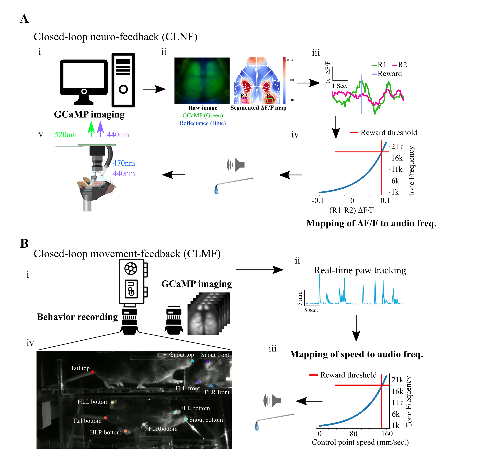
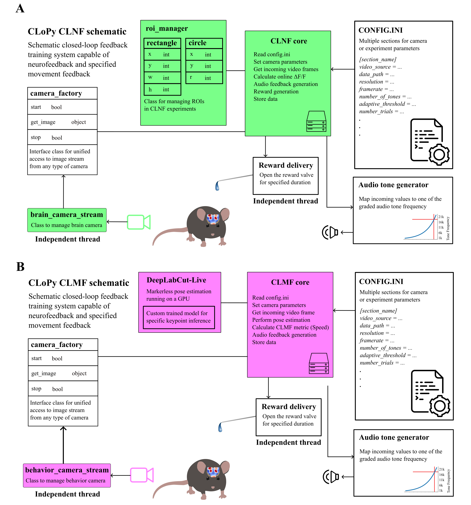

# CLoPy - Closed-Loop Feedback Training System

CLoPy is a closed-loop feedback training system for neurofeedback and specified movement feedback in mice. This system enables real-time manipulation of neural activity or behavior based on calcium imaging or pose estimation.

!!! info "Paper"
    This work accompanies the research paper: [https://elifesciences.org/reviewed-preprints/105070](https://elifesciences.org/reviewed-preprints/105070)

## Overview

CLoPy implements two complementary closed-loop paradigms:

| Feature | CLNF | CLMF |
|---------|------|------|
| **Full Name** | Closed-Loop Neurofeedback | Closed-Loop Movement Feedback |
| **Input** | Calcium imaging (Gcamp6f) | DeepLabCut pose estimation |
| **Platform** | Raspberry Pi 4B+ | Nvidia Jetson Orin |
| **Feedback** | Audio tones mapped to neural activity | Audio tones mapped to movement speed |
| **Reward** | Water reward on threshold crossing | Water reward on target movement |

## System Architecture
**Setup of real-time feedback for GCaMP6 cortical activity and movements**


**Schematic of the closed-loop feedback training system (CLoPy) for neurofeedback and specified movement feedback**


## Key Features

- **Real-time Processing**: Sub-second latency for feedback delivery
- **Adaptive Thresholding**: Automatically adjusts reward thresholds based on performance
- **Multiple ROI Support**: Single ROI (1ROI) or dual ROI (2ROI) experiments
- **Audio Feedback**: Sonification of neural activity or movement speed using variable frequency tones
- **Trial-based Structure**: Well-defined trials with rest periods and success/fail outcomes
- **Data Logging**: Comprehensive logging of all parameters and events

## Folder Structure

```
clopy/
├── analysis/                    # Data analysis scripts
│   ├── get_clmf_data.py
│   ├── plot_clmf.py
│   └── plot_clnf.py
├── assets/                      # Images and animations
├── behavior/                    # CLMF experiment scripts
│   └── cla_dlc_trials_speed.py
├── brain/                       # CLNF experiment scripts
│   ├── cla_reward_punish_1roi.py
│   └── cla_reward_punish_2roi.py
├── docs/                        # Documentation
├── CameraFactory.py             # Camera abstraction
├── config.ini                   # Configuration file
├── helper.py                    # Utility functions
├── roi_manager.py               # ROI management
├── PiCameraStream.py            # Pi Camera driver
├── SentechCameraStream.py       # Sentech Camera driver
└── VideoStream.py               # Video capture
```

## Quick Links

- [Installation Guide](installation.md)
- [CLNF Experiment Setup](clnf.md)
- [CLMF Experiment Setup](clmf.md)
- [Configuration Reference](configuration.md)
- [Hardware Assembly](hardware.md)
- [Troubleshooting](troubleshooting.md)